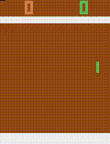

# Rainbow: Playing Atari Using Deep RL
## Objective
Replicate the paper [Rainbow: Combining Improvements in Deep Reinforcement Learning](https://arxiv.org/abs/1710.02298)

## Implemented Algorithms
- [x] Vanilla DQN
- [x] Double DQN
- [x] Noisy Nets / Factorized Noisy Nets
- [x] Multi Step Learning
- [ ] Distributional RL
- [ ] Dueling Networks

## Output for Pong
<p align="center">
    
</p>

## Run commands
Go to the directory Atari_v1<br/>
Train the model by running ```python atari_main.py```

Afte training, the model and the video of the learned model are saved in the same folder

